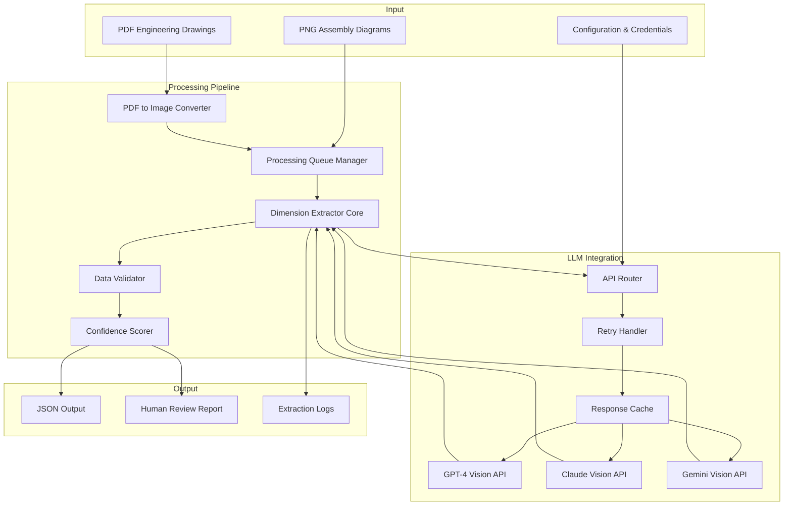

# Design Document: Dimension Extraction System

## Overview

The Dimension Extraction System is a Python-based tool that automates the extraction of dimensional and tolerance data from engineering drawings in PDF format. The system leverages state-of-the-art Large Language Model (LLM) vision APIs (GPT-4 Vision, Claude Vision, Gemini Vision) to parse technical drawings and extract structured dimensional data for tolerance stack-up analysis.

### Primary Use Case

The system's primary application is analyzing bolt protrusion depth in mechanical assemblies by:
1. Processing individual part drawings (PDFs) to extract dimensions, tolerances, and GD&T callouts
2. Processing assembly diagrams (PNG) to understand part relationships
3. Identifying dimensional chains that contribute to critical measurements
4. Outputting structured JSON data for downstream stack-up calculation tools

### Key Design Principles

- **API-First Architecture**: Leverage existing LLM vision capabilities rather than building custom computer vision models
- **Structured Output**: All extracted data conforms to a well-defined JSON schema for interoperability
- **Confidence-Driven Workflow**: Every extraction includes confidence scoring to enable human-in-the-loop review
- **Resilience**: Robust error handling, retry logic, and graceful degradation for production use
- **Cost Optimization**: Caching, batching, and image optimization to minimize API costs

## Architecture

### High-Level System Architecture



### Component Responsibilities

#### 1. PDF to Image Converter
- Converts PDF pages to high-resolution images (300+ DPI) using `pdf2image` library (wrapper for poppler-utils)
- Handles multi-page PDFs by processing each page independently
- Manages encrypted/password-protected PDFs
- Optimizes image resolution for API cost vs. quality trade-off

#### 2. Processing Queue Manager
- Maintains a queue of files to process (both converted PDF pages and PNG assembly diagrams)
- Tracks processing status (pending, in-progress, completed, failed)
- Provides progress reporting (percentage complete)
- Enables batch processing with failure isolation

#### 3. Dimension Extractor Core
- Orchestrates the extraction workflow for each drawing
- Constructs prompts for LLM vision APIs with domain-specific instructions
- Parses LLM responses into structured data
- Handles assembly relationship extraction from PNG diagrams
- Identifies dimensional chains based on assembly context

#### 4. API Router
- Selects the appropriate LLM API based on configuration
- Abstracts API-specific differences behind a unified interface
- Routes requests to the configured provider (GPT-4 Vision, Claude, Gemini)
- Tracks API usage statistics for cost monitoring

#### 5. Retry Handler
- Implements exponential backoff with jitter for transient failures
- Handles rate limiting (429 errors) by respecting Retry-After headers
- Retries timeout errors up to 3 attempts
- Logs all retry attempts with timestamps

#### 6. Response Cache
- Caches LLM API responses keyed by image hash
- Reduces redundant API calls for identical images
- Implements cache invalidation based on configuration changes
- Stores cache persistently to disk for cross-session reuse

#### 7. Data Validator
- Validates extracted data against engineering rules (e.g., tolerances < nominal dimensions)
- Checks datum reference consistency (all referenced datums are defined)
- Validates unit consistency within each part
- Flags validation failures with warnings

#### 8. Confidence Scorer
- Calculates confidence scores (0.0-1.0) for each extracted element
- Combines LLM response confidence with validation results
- Assigns lower scores to data failing validation checks
- Flags extractions below 0.7 threshold for mandatory human review

## Components and Interfaces

### Core Classes

#### DimensionExtractor
```python
class DimensionExtractor:
    """Main orchestrator for the extraction pipeline."""
    
    def __init__(self, config: ExtractorConfig):
        self.config = config
        self.api_router = APIRouter(config.api_config)
        self.validator = DataValidator()
        self.confidence_scorer = ConfidenceScorer()
        self.cache = ResponseCache(config.cache_dir)
    
    def process_pdf(self, pdf_path: Path) -> ExtractionResult:
        """Process a single PDF engineering drawing."""
        pass
    
    def process_assembly_diagram(self, png_path: Path) -> AssemblyResult:
        """Process a PNG assembly diagram."""
        pass
    
    def process_batch(self, file_paths: List[Path]) -> BatchResult:
        """Process multiple files in batch."""
        pass
    
    def identify_dimensional_chains(
        self, 
        parts: List[PartData], 
        assembly: AssemblyResult
    ) -> List[DimensionalChain]:
        """Identify dimensional chains from extracted data."""
        pass
```

#### APIRouter
```python
class APIRouter:
    """Routes requests to configured LLM vision API."""
    
    def __init__(self, config: APIConfig):
        self.config = config
        self.retry_handler = RetryHandler()
        self.cache = ResponseCache()
    
    def extract_from_image(
        self, 
        image: Image, 
        prompt: str
    ) -> APIResponse:
        """Send image and prompt to configured LLM API."""
        pass
    
    def _call_gpt4_vision(self, image: Image, prompt: str) -> APIResponse:
        """Call GPT-4 Vision API."""
        pass
    
    def _call_claude_vision(self, image: Image, prompt: str) -> APIResponse:
        """Call Claude Vision API."""
        pass
    
    def _call_gemini_vision(self, image: Image, prompt: str) -> APIResponse:
        """Call Gemini Vision API."""
        pass
```

#### DataValidator
```python
class DataValidator:
    """Validates extracted data against engineering rules."""
    
    def validate_dimension(self, dimension: Dimension) -> ValidationResult:
        """Validate a single dimension extraction."""
        pass
    
    def validate_tolerance(
        self, 
        tolerance: Tolerance, 
        nominal: float
    ) -> ValidationResult:
        """Validate tolerance is reasonable relative to nominal."""
        pass
    
    def validate_datum_references(
        self, 
        gdt_callouts: List[GDTCallout], 
        datums: List[Datum]
    ) -> ValidationResult:
        """Validate all referenced datums are defined."""
        pass
    
    def validate_units(self, dimensions: List[Dimension]) -> ValidationResult:
        """Validate unit consistency within a part."""
        pass
```

#### ConfidenceScorer
```python
class ConfidenceScorer:
    """Calculates confidence scores for extracted data."""
    
    def score_dimension(
        self, 
        dimension: Dimension, 
        llm_confidence: float, 
        validation: ValidationResult
    ) -> float:
        """Calculate confidence score for a dimension."""
        pass
    
    def score_extraction_result(
        self, 
        result: ExtractionResult
    ) -> float:
        """Calculate overall confidence for an extraction."""
        pass
    
    def _combine_scores(
        self, 
        llm_confidence: float, 
        validation_score: float
    ) -> float:
        """Combine LLM and validation scores."""
        pass
```

### API Integration Patterns

#### Unified API Interface
All LLM vision APIs are accessed through a common interface that abstracts provider-specific differences:

```python
@dataclass
class APIResponse:
    """Unified response format from any LLM vision API."""
    raw_text: str
    structured_data: Dict[str, Any]
    confidence: float
    provider: str
    tokens_used: int
    cost_estimate: float
```

#### Provider-Specific Adapters

**GPT-4 Vision Adapter**
- Uses OpenAI's `gpt-4-vision-preview` model
- Supports structured output via function calling
- Image input via base64 encoding or URL
- Rate limits: Tier-dependent (typically 500 RPM for tier 3)

**Claude Vision Adapter**
- Uses Anthropic's `claude-3-opus` or `claude-3-sonnet` models
- Supports vision via message content blocks
- Image input via base64 encoding
- Rate limits: Tier-dependent (typically 50 RPM for tier 1)

**Gemini Vision Adapter**
- Uses Google's `gemini-1.5-pro-vision` model
- Supports multimodal input (text + images)
- Image input via inline data or Cloud Storage URIs
- Rate limits: 60 RPM for free tier, higher for paid

#### Retry Strategy

Content was rephrased for compliance with licensing restrictions. The system implements exponential backoff with jitter to handle transient API failures:

```python
from tenacity import (
    retry,
    stop_after_attempt,
    wait_exponential,
    retry_if_exception_type
)

class RetryHandler:
    @retry(
        stop=stop_after_attempt(3),
        wait=wait_exponential(multiplier=1, min=2, max=60),
        retry=retry_if_exception_type((RateLimitError, TimeoutError))
    )
    def call_with_retry(self, api_call: Callable) -> APIResponse:
        """Execute API call with automatic retry logic."""
        return api_call()
```

Key retry behaviors:
- Rate limit errors (429): Respect `Retry-After` header if present, otherwise exponential backoff
- Timeout errors: Retry up to 3 times with exponential backoff (2s, 4s, 8s, ...)
- Authentication errors: No retry, immediate failure with clear error message
- Server errors (5xx): Retry up to 3 times

## Data Models

### Core Data Structures

#### Dimension
```python
@dataclass
class Dimension:
    """Represents a single dimension extraction."""
    id: str
    nominal_value: float
    unit: str  # "mm", "in", etc.
    tolerance: Optional[Tolerance]
    feature_description: str
    part_id: str
    source_location: SourceLocation
    confidence_score: float
    extraction_context: str
```

#### Tolerance
```python
@dataclass
class Tolerance:
    """Represents tolerance information."""
    type: ToleranceType  # BILATERAL, UNILATERAL, LIMIT
    upper_deviation: float
    lower_deviation: float
    confidence_score: float
```

```python
class ToleranceType(Enum):
    BILATERAL = "bilateral"  # ±0.1
    UNILATERAL = "unilateral"  # +0.2/-0.1
    LIMIT = "limit"  # 50.0-50.2
```

#### GDTCallout
```python
@dataclass
class GDTCallout:
    """Represents a GD&T feature control frame."""
    id: str
    symbol_type: GDTSymbol
    tolerance_zone: float
    material_condition: Optional[MaterialCondition]
    datum_references: List[str]  # Datum IDs
    controlled_feature: str
    part_id: str
    confidence_score: float
```

```python
class GDTSymbol(Enum):
    FLATNESS = "flatness"
    PERPENDICULARITY = "perpendicularity"
    PARALLELISM = "parallelism"
    POSITION = "position"
    CONCENTRICITY = "concentricity"
    CIRCULARITY = "circularity"
    # ... additional GD&T symbols
```

```python
class MaterialCondition(Enum):
    MMC = "maximum_material_condition"
    LMC = "least_material_condition"
    RFS = "regardless_of_feature_size"
```

#### Datum
```python
@dataclass
class Datum:
    """Represents a datum reference."""
    id: str
    label: str  # "A", "B", "C", etc.
    feature_description: str
    part_id: str
    confidence_score: float
```

#### MaterialSpec
```python
@dataclass
class MaterialSpec:
    """Represents material specifications."""
    material_type: str
    material_grade: Optional[str]
    surface_finish: Optional[str]
    heat_treatment: Optional[str]
    part_id: str
    confidence_score: float
```

#### AssemblyRelationship
```python
@dataclass
class AssemblyRelationship:
    """Represents how two parts mate in an assembly."""
    part1_id: str
    part2_id: str
    mating_surface1: str
    mating_surface2: str
    relationship_type: RelationshipType
    confidence_score: float
```

```python
class RelationshipType(Enum):
    BOLTED = "bolted"
    PRESSED = "pressed"
    WELDED = "welded"
    ADHESIVE = "adhesive"
    CONTACT = "contact"
```

#### DimensionalChain
```python
@dataclass
class DimensionalChain:
    """Represents a sequence of dimensions contributing to a critical measurement."""
    chain_id: str
    target_measurement: str  # e.g., "bolt_protrusion_depth"
    contributing_dimensions: List[ChainLink]
    total_nominal: float
    worst_case_max: float
    worst_case_min: float
    confidence_score: float
```

```python
@dataclass
class ChainLink:
    """A single dimension in a dimensional chain."""
    dimension_id: str
    contribution_sign: int  # +1 or -1
    contribution_rank: float  # Importance to critical measurement
```

### JSON Output Schema

The system outputs data conforming to the following JSON schema:

```json
{
  "$schema": "http://json-schema.org/draft-07/schema#",
  "title": "DimensionExtractionOutput",
  "type": "object",
  "required": ["metadata", "parts", "assembly", "dimensional_chains"],
  "properties": {
    "metadata": {
      "type": "object",
      "required": ["extraction_timestamp", "extractor_version", "api_provider"],
      "properties": {
        "extraction_timestamp": {"type": "string", "format": "date-time"},
        "extractor_version": {"type": "string"},
        "api_provider": {"type": "string", "enum": ["gpt4", "claude", "gemini"]},
        "total_api_cost": {"type": "number"},
        "overall_confidence": {"type": "number", "minimum": 0, "maximum": 1}
      }
    },
    "parts": {
      "type": "array",
      "items": {
        "type": "object",
        "required": ["part_id", "source_file", "dimensions"],
        "properties": {
          "part_id": {"type": "string"},
          "source_file": {"type": "string"},
          "dimensions": {
            "type": "array",
            "items": {
              "type": "object",
              "required": ["id", "nominal_value", "unit", "feature_description", "confidence_score"],
              "properties": {
                "id": {"type": "string"},
                "nominal_value": {"type": "number"},
                "unit": {"type": "string"},
                "tolerance": {
                  "type": "object",
                  "required": ["type", "upper_deviation", "lower_deviation"],
                  "properties": {
                    "type": {"type": "string", "enum": ["bilateral", "unilateral", "limit"]},
                    "upper_deviation": {"type": "number"},
                    "lower_deviation": {"type": "number"},
                    "confidence_score": {"type": "number", "minimum": 0, "maximum": 1}
                  }
                },
                "feature_description": {"type": "string"},
                "source_location": {
                  "type": "object",
                  "properties": {
                    "page": {"type": "integer"},
                    "zone": {"type": "string"}
                  }
                },
                "confidence_score": {"type": "number", "minimum": 0, "maximum": 1},
                "extraction_context": {"type": "string"}
              }
            }
          },
          "gdt_callouts": {"type": "array"},
          "datums": {"type": "array"},
          "material_spec": {"type": "object"}
        }
      }
    },
    "assembly": {
      "type": "object",
      "properties": {
        "source_file": {"type": "string"},
        "relationships": {
          "type": "array",
          "items": {
            "type": "object",
            "required": ["part1_id", "part2_id", "relationship_type"],
            "properties": {
              "part1_id": {"type": "string"},
              "part2_id": {"type": "string"},
              "mating_surface1": {"type": "string"},
              "mating_surface2": {"type": "string"},
              "relationship_type": {"type": "string"},
              "confidence_score": {"type": "number", "minimum": 0, "maximum": 1}
            }
          }
        }
      }
    },
    "dimensional_chains": {
      "type": "array",
      "items": {
        "type": "object",
        "required": ["chain_id", "target_measurement", "contributing_dimensions"],
        "properties": {
          "chain_id": {"type": "string"},
          "target_measurement": {"type": "string"},
          "contributing_dimensions": {
            "type": "array",
            "items": {
              "type": "object",
              "required": ["dimension_id", "contribution_sign"],
              "properties": {
                "dimension_id": {"type": "string"},
                "contribution_sign": {"type": "integer", "enum": [1, -1]},
                "contribution_rank": {"type": "number"}
              }
            }
          },
          "total_nominal": {"type": "number"},
          "worst_case_max": {"type": "number"},
          "worst_case_min": {"type": "number"},
          "confidence_score": {"type": "number", "minimum": 0, "maximum": 1}
        }
      }
    },
    "validation_warnings": {
      "type": "array",
      "items": {
        "type": "object",
        "properties": {
          "severity": {"type": "string", "enum": ["warning", "error"]},
          "message": {"type": "string"},
          "affected_element_id": {"type": "string"}
        }
      }
    }
  }
}
```

### JSON Parser and Pretty Printer

```python
class JSONParser:
    """Parses JSON output into structured Python objects."""
    
    def __init__(self, schema_path: Path):
        self.schema = self._load_schema(schema_path)
    
    def parse(self, json_path: Path) -> ExtractionOutput:
        """Parse JSON file into ExtractionOutput object."""
        with open(json_path, 'r') as f:
            data = json.load(f)
        
        # Validate against schema
        jsonschema.validate(data, self.schema)
        
        # Convert to Python objects
        return self._dict_to_objects(data)
    
    def _dict_to_objects(self, data: Dict) -> ExtractionOutput:
        """Convert dictionary to typed Python objects."""
        pass

class JSONPrettyPrinter:
    """Formats ExtractionOutput objects back to JSON."""
    
    def print(self, output: ExtractionOutput, json_path: Path):
        """Write ExtractionOutput to formatted JSON file."""
        data = self._objects_to_dict(output)
        
        with open(json_path, 'w') as f:
            json.dump(data, f, indent=2, sort_keys=True)
    
    def _objects_to_dict(self, output: ExtractionOutput) -> Dict:
        """Convert Python objects to dictionary."""
        pass
```

## Error Handling

### Error Categories and Strategies

#### 1. API Errors

**Rate Limit Errors (429)**
- Strategy: Exponential backoff with jitter
- Respect `Retry-After` header when provided
- Maximum 3 retry attempts
- Log all rate limit encounters for cost analysis

**Authentication Errors (401, 403)**
- Strategy: Immediate failure, no retry
- Clear error message indicating credential issue
- Terminate processing to avoid wasting API calls

**Timeout Errors**
- Strategy: Retry up to 3 times with exponential backoff
- Increase timeout threshold on each retry
- Log timeout occurrences for performance monitoring

**Server Errors (5xx)**
- Strategy: Retry up to 3 times
- Exponential backoff between retries
- Continue processing other files if one fails

#### 2. Input File Errors

**Encrypted/Password-Protected PDFs**
- Strategy: Skip file with warning
- Log skipped file for manual review
- Continue processing remaining files

**Corrupted PDF Files**
- Strategy: Attempt recovery, skip if unrecoverable
- Log error with file details
- Continue processing remaining files

**Unsupported Image Formats**
- Strategy: Attempt conversion to supported format
- Skip if conversion fails
- Log unsupported format warning

#### 3. Extraction Errors

**Unparseable LLM Response**
- Strategy: Retry with clarified prompt
- If retry fails, mark extraction as low confidence
- Flag for mandatory human review

**Missing Critical Data**
- Strategy: Mark as incomplete extraction
- Assign low confidence score
- Flag for human review

**Validation Failures**
- Strategy: Include data with warning flag
- Reduce confidence score
- Log validation failure details

#### 4. System Errors

**Disk Space Exhaustion**
- Strategy: Clean up temporary files
- Fail gracefully with clear error message
- Preserve partial results if possible

**Memory Exhaustion**
- Strategy: Process files in smaller batches
- Implement streaming for large files
- Log memory usage warnings

### Error Logging

All errors are logged with structured information:

```python
@dataclass
class ErrorLog:
    timestamp: datetime
    error_type: str
    severity: str  # "warning", "error", "critical"
    message: str
    context: Dict[str, Any]
    stack_trace: Optional[str]
```

Error logs are written to:
- Console (for immediate visibility)
- Log file (for audit trail)
- JSON summary (for programmatic analysis)

## Testing Strategy

### Unit Testing

Unit tests will verify individual components in isolation:

**PDF Conversion Tests**
- Test conversion of single-page and multi-page PDFs
- Test handling of encrypted PDFs
- Test DPI settings and image quality
- Test error handling for corrupted files

**API Router Tests**
- Test provider selection logic
- Test request formatting for each provider
- Test response parsing for each provider
- Mock API calls to avoid costs

**Validation Tests**
- Test tolerance validation (tolerance < nominal)
- Test datum reference validation
- Test unit consistency validation
- Test edge cases (zero tolerances, missing data)

**Confidence Scoring Tests**
- Test score calculation with various inputs
- Test score combination logic
- Test threshold-based flagging
- Test edge cases (perfect confidence, zero confidence)

**JSON Parser Tests**
- Test parsing of valid JSON files
- Test error handling for invalid JSON
- Test schema validation
- Test round-trip property (parse → print → parse)

### Integration Testing

Integration tests will verify component interactions:

**End-to-End Extraction Tests**
- Test complete pipeline with sample drawings
- Verify JSON output structure and content
- Test batch processing with multiple files
- Test assembly relationship extraction

**API Integration Tests**
- Test actual API calls (with cost limits)
- Verify response handling for each provider
- Test retry logic with simulated failures
- Test caching behavior

**File Processing Tests**
- Test processing of real engineering drawings
- Verify extraction accuracy against known ground truth
- Test handling of various drawing styles and formats

### Property-Based Testing

Property-based tests will verify universal correctness properties across randomized inputs. The system will use a Python property-based testing library (e.g., Hypothesis) configured to run a minimum of 100 iterations per property test.

Each property test will include a comment tag referencing the design document property it validates:
```python
# Feature: dimension-extraction-system, Property 1: JSON round-trip preserves data
```

Property-based testing is appropriate for this system because:
- JSON parsing/serialization has clear round-trip properties
- Validation logic should hold across all valid inputs
- Confidence scoring should maintain invariants (0.0-1.0 range, monotonicity)
- Dimensional chain calculations have mathematical properties

The specific correctness properties will be defined in the Correctness Properties section below.


## Correctness Properties

*A property is a characteristic or behavior that should hold true across all valid executions of a system—essentially, a formal statement about what the system should do. Properties serve as the bridge between human-readable specifications and machine-verifiable correctness guarantees.*

### Property 1: JSON Round-Trip Preservation

*For any* valid ExtractionOutput object, serializing to JSON then parsing back to an object SHALL produce an equivalent object (parse(print(parse(json))) == parse(json)).

**Validates: Requirements 9.4**

This is the most critical property for data integrity. It ensures that no information is lost during serialization and deserialization, which is essential for data persistence and interoperability with downstream tools.

### Property 2: Confidence Score Range Invariant

*For any* extracted data element (dimension, tolerance, GD&T callout, datum, material spec, assembly relationship), the assigned confidence score SHALL be in the range [0.0, 1.0] inclusive.

**Validates: Requirements 1.4, 2.4, 3.5, 4.5, 15.1**

This property ensures that confidence scores are always valid probabilities, preventing downstream tools from receiving invalid confidence values.

### Property 3: Referential Integrity

*For any* extraction result, all references SHALL point to defined entities:
- All dimension.part_id values SHALL reference defined parts
- All tolerance.dimension_id values SHALL reference defined dimensions
- All gdt_callout.datum_references SHALL reference defined datums
- All gdt_callout.controlled_feature SHALL reference defined features
- All chain_link.dimension_id values SHALL reference defined dimensions

**Validates: Requirements 1.2, 2.3, 3.4, 4.4, 13.2**

This property ensures data consistency and prevents dangling references that would cause errors in downstream analysis.

### Property 4: Tolerance Magnitude Validation

*For any* dimension with an associated tolerance, the tolerance magnitude (max(|upper_deviation|, |lower_deviation|)) SHALL be less than the nominal dimension value.

**Validates: Requirements 13.1**

This property enforces a fundamental engineering rule: tolerances should be smaller than the nominal dimension they modify. Violations indicate extraction errors.

### Property 5: Unit Consistency Within Parts

*For any* part in the extraction result, all dimensions belonging to that part SHALL use the same unit of measurement.

**Validates: Requirements 13.3**

This property ensures dimensional consistency within each part, preventing unit mixing errors that would invalidate stack-up calculations.

### Property 6: Validation Failure Reduces Confidence

*For any* two otherwise identical extractions where one passes validation and the other fails validation, the failed extraction SHALL have a lower confidence score than the passed extraction.

**Validates: Requirements 13.4, 15.3**

This property ensures monotonicity in confidence scoring: validation failures should always decrease confidence, never increase it.

### Property 7: Failure Isolation in Batch Processing

*For any* batch of files where one file fails to process, the system SHALL successfully process all other files in the batch and include them in the output.

**Validates: Requirements 11.4, 12.4**

This property ensures robustness: a single file failure should not prevent processing of other files in the batch.

### Property 8: Cache Hit for Identical Inputs

*For any* image that is processed twice with identical content (same image hash), the second processing SHALL return a cached response without making an additional API call.

**Validates: Requirements 20.1**

This property ensures cost optimization: identical inputs should reuse cached results rather than making redundant API calls.

### Property 9: Retry Behavior for Rate Limits

*For any* API call that returns a rate limit error (429), the system SHALL retry the request with exponential backoff, respecting any Retry-After header, up to a maximum of 3 attempts.

**Validates: Requirements 11.1**

This property ensures proper rate limit handling, preventing API quota exhaustion while maximizing successful request completion.

### Property 10: Retry Behavior for Timeouts

*For any* API call that times out, the system SHALL retry the request exactly 3 times with exponential backoff before marking the request as failed.

**Validates: Requirements 11.3**

This property ensures consistent timeout handling across all API calls.

### Property 11: Multi-Page PDF Completeness

*For any* multi-page PDF file with N pages, the system SHALL process all N pages and include extractions from all pages in the output.

**Validates: Requirements 16.3**

This property ensures no pages are skipped during PDF processing.

### Property 12: Progress Calculation Accuracy

*For any* batch processing operation with N total files and M completed files, the reported progress percentage SHALL equal (M / N) * 100.

**Validates: Requirements 12.3**

This property ensures accurate progress reporting for user feedback.

### Property 13: JSON Schema Compliance

*For any* extraction result output, the generated JSON SHALL validate successfully against the defined JSON schema.

**Validates: Requirements 8.1, 8.5, 9.3**

This property ensures all outputs conform to the expected structure, enabling reliable integration with downstream tools.

### Property 14: Output Completeness

*For any* extraction result, all required fields SHALL be present:
- All dimensions SHALL have extraction_context
- All extracted elements SHALL have confidence_score
- All extracted elements SHALL have source_location

**Validates: Requirements 8.2, 8.3, 8.4**

This property ensures no required metadata is missing from the output.

### Property 15: Dimensional Chain Sign Consistency

*For any* dimensional chain, the sum of (dimension.nominal_value * chain_link.contribution_sign) for all contributing dimensions SHALL equal the chain's total_nominal value.

**Validates: Requirements 7.3**

This property ensures mathematical consistency in dimensional chain calculations: the signs must be correct for the chain to sum properly.

### Property 16: Missing Tolerance Flagging

*For any* dimension that lacks an associated tolerance object, the dimension SHALL be flagged in the validation_warnings array with a "missing tolerance" warning.

**Validates: Requirements 2.5**

This property ensures incomplete data is always flagged for human review.

### Property 17: Error Logging Completeness

*For any* API error that occurs during processing, an error log entry SHALL be created with timestamp, error_type, severity, message, and context.

**Validates: Requirements 11.5, 19.1, 19.2, 19.3, 19.4**

This property ensures all errors are properly logged for debugging and audit purposes.

### Property 18: Image Resolution Preservation

*For any* PDF page converted to an image, the output image SHALL have a resolution of at least 300 DPI.

**Validates: Requirements 16.2**

This property ensures converted images maintain sufficient quality for dimension extraction.

### Property 19: Confidence Score Threshold Flagging

*For any* extracted element with confidence_score < 0.7, the element SHALL be flagged in the validation_warnings array for mandatory human review.

**Validates: Requirements 15.5**

This property ensures low-confidence extractions are always flagged for review.

### Property 20: Unit Preservation

*For any* dimension extracted with a unit of measurement, the unit SHALL be preserved unchanged in the output JSON.

**Validates: Requirements 1.5**

This property ensures unit information is never lost during processing.

